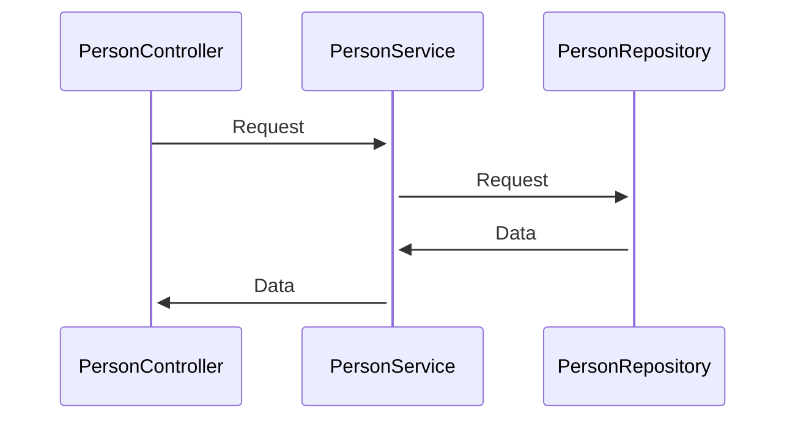
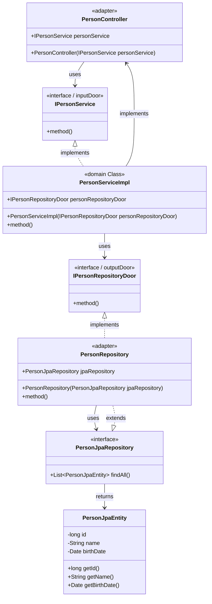

# Hexagon java sample
Este projeto tem como finalidade demonstrar o uso da arquitetura hexagonal sem gerar dependencia nas camadas de dominio.

## Fluxo de uma requisição REST (GET)

Visão simplificada da requisição

A visão acima é comum em muitas arquiteturas, porém para o uso de uma arquitetura hexagonal em que não se pode gerar dependência nas camadas de dominio, existe o desafio de implementação sem notações ou o uso de classes frameworks externos, como o JPA por exemplo nas classes de entidade.

Para tentar resolver este problema, adotei a seguinte estragia apresentada no diagrama abaixo:

O diagrama de classes acima tem a finalidade de exemplificar e por isso não está completo em relação ao projeto. A idéia é abstrair o conceito implementado.

No exemplo temos como Adaptadores:
- PersonController
    - Que recebe por DI a interface IPersonService que é a porta de entrada
- PersonJpaRepository
    - Repositório JPA que implementa os pacotes e dependencias externas
- PersonRepository
    - Na camada infraestructure que implementa a porta IPersonRepositoryDoor
    - Recebe por DI no construtor PersonJpaRepository

Portas:
- IPersonService
    - interface que define e abstrai os metodos de entrada do dominio
- IPersonRepositoryDoor
    - Interface que define os metodos de saida do dominio

Classe de dominio:
- RepositoryService
    - Implementa IPersonService
- Person
    - Modelo de pessoa

Existe ainda na camada Infraestructure uma segunda entidade que recebe as notations de JPA para a persistencia, e ela disponibiliza dois metodos para uma facilitar o intercâmbio entre entidade de dominio e de persistencia por composição.

A magia está na abstração das interfaces e na inversão de controle por injeção de dependencia.

Deste modo podemos garantir o isolamento da camada de dominio.

## Pontos fortes
- Baixo acoplamento
    - Se houver o desejo de utilizar outro framework para persistir em banco de dados, a manutenção será feita nos adaptadores e na camada externa sem afetar o dominio
- Não há dependencia de pacotes das camadas externas na camada de dominio

## Pontos fracos
- Maior complexidade de implementação inicial
- Para impedir o uso de pacotes na camada interna foi necessário criar muito mais codigos do que em uma arquitetura convencional de camadas
